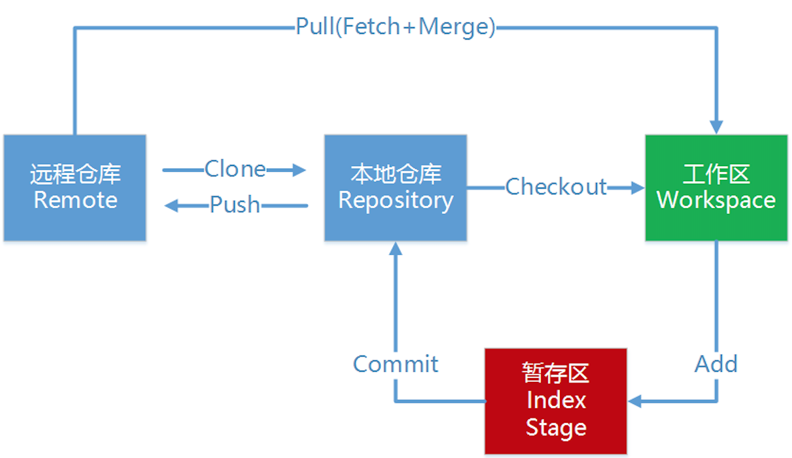
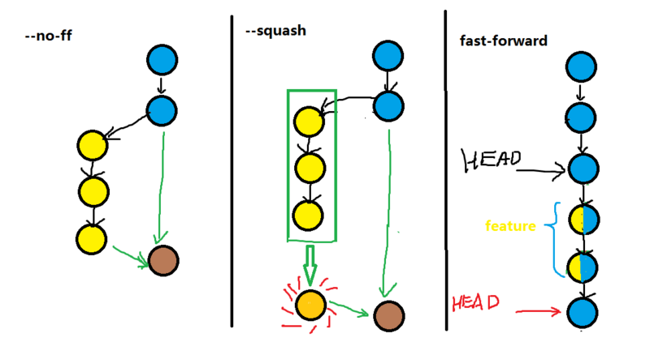

# 简单粗暴入门Git

代码、文档在迭代过程中不可避免会遇到版本管理的问题，在没有版本管理概念的时代，文档的管理只能通过多次另存为新文件实现，操作方法复杂，占空间大，而且依赖硬件设备。一旦硬盘损坏或丢失，后果不堪设想

一般来说，我们会将要管理的文档加入到git仓库，将本地仓库和云端仓库进行同步，这样可以在任何电脑上、任何时候进行代码和文档的更新。在这一点上，Git和SVN区别不大。那为何用Git呢？Git以其独特的分支结构，使得团队协作时代码管理变得更加轻松便捷，并且网络上有众多基于Git的平台，上边有无数开源代码，生态十分繁荣。掌握Git可谓是程序员最基本的需求。扩展开来，任何从事和版本管理/团队协作相关工作的人，不管是否是写代码，都可以用Git进行管理：博客、论文、数据……建立起版本管理意识能够大大提高效率，提升安全性

先去https://git-scm.com/ 下载git-bash，然后设置用户名和邮箱：
```bash
git config --global user.name "你的名字"
git config --global user.email "你的邮箱"
```

## 0 git的Lifecycle一览图



## 1 基础

### `init`：初始化git仓库

切换到想要建仓库的目录，`git init`

### `status`：查看文件状态

- 详细：`git status`
- 简略：`git status -s`

### `add`：将改动添加到暂存区

- 添加所有文件：`git add .`
- 添加某个文件：`git add 文件名`，注意要加上扩展名
> 涉及到文件操作的，指定文件方法下同

### `commit`：将暂存区的文件提交

- add内容作为新的提交：`git commit -m "提交信息"`
- `git commit -am "提交信息"`：添加并提交的快捷方法
 > 使用此方法时，untrack的新文件不会被添加和提交

- add内容提交到上一次提交：`git commit --amend --no-edit`
 - 此操作不会增加新的提交，不过会改变上一次提交的id
 - `--no-edit`不会修改提交的信息，如果想修改提交信息，将之换成`-m "提交信息"`
 > 尽量每次提交都有意义，无硬bug，减少此操作


### `log`：查看提交

- 详细：`git log`
- 简略，只显示提交的id头和信息：`git log --oneline`

### `reflog`：查看历次操作的HEAD指针状况

- HEAD指向旧commit时，获得之后的commit id：`git reflog`

### `diff`：查看文件和上一次commit的差异

- 修改后未`add`：`git diff`
- `add`之后：`git diff --cached`
- `add`之后又修改，未`add`：`git diff HEAD`

### `checkout`：前进式版本回退

- 回退到某个commit：`git checkout commit的id头 -- 文件名`，此方法会生成一个新的commit
- 放弃修改：修改之后未add和commit，想要放弃修改重新来过：`git chekcout -- 文件名`

## 2 分支

### 基础操作

- `git branch` 查看各分支
- `git log --oneline --graph`：以图的形式查看各分支
- `git checkout 分支名`：切换到指定分支
- `git checkout -b 分支名`：从当前的分支新建出分支并切换到新分支
- `git branch -d 分支名`删除分支（不能删除当前所在的分支）
- `git merge --no-ff -m 合并信息 分支名`：将指定分支合并到当前分支，保留分支的commit历史
 - 合并分支时的参数选择：默认（ff）、`--squash`和`--no-ff`示意图。`squash`把多次分支commit历史压缩为一次



### 冲突处理

如果两个分支上修改了不同文件，不会报错，可以直接合并
如果两个分支上修改的文件有冲突了，则需要手动合并
`git merge 分支名`之后会报错，打开有冲突的文件，找到冲突的地方（git会标出来）：

```python
<<<<<<
冲突内容
========
冲突内容
>>>>>>
```

手动修改，然后提交，即可解决冲突

### `stash`：临时修改

解决临时委派的任务，将当前的工作暂存`git stash`
然后去完成临时任务
完成临时任务后，拿出暂存的工作`git stash pop`，继续工作

## 3 代码托管

### 初始化远程库

使用本地项目初始化远程库。项目管理员操作

```bash
git remote add origin 远程空仓库的url
git push -u origin 分支名
```

### 克隆远程仓库到本地。默认只克隆远程HEAD所指向的分支

`git clone 远程仓库的url`

### 查看本地、远程的所有分支

`git branch -a`

### 克隆某个远程分支到本地

`git checkout -b 分支名 origin/分支名`
> 为了后续操作方便，使用此方法克隆远程分支时请保证两分支名相同

### 同步

- `git push`将更新提交到远程

- `git pull`从远程库更新本地

- `fetch`：另一种从远程库更新本地的方法

```bash
//方法一
git fetch origin 分支名 //从远程的origin仓库的指定分支下载代码到本地的origin指定分支
git log -p 分支名.. origin/分支名//比较本地的仓库和远程参考的区别
git merge origin/分支名//把远程下载下来的代码合并到本地仓库，远程的和本地的合并
```

```bash
//方法二
git fetch origin 分支名:temp //从远程的origin仓库的指定分支下载到本地并新建一个分支temp
git diff temp//比较指定分支和temp分支的不同
git merge temp//合并temp分支到master分支
git branch -d temp//删除temp
```

> 在结果上，fetch + merge = pull

### 远程版本回退

和单机版的版本回退不同，此操作可以同时将远程的版本回退
`git revert commit的id头`回退本地，然后再push，即可回退远程。此操作属于前进式回退
